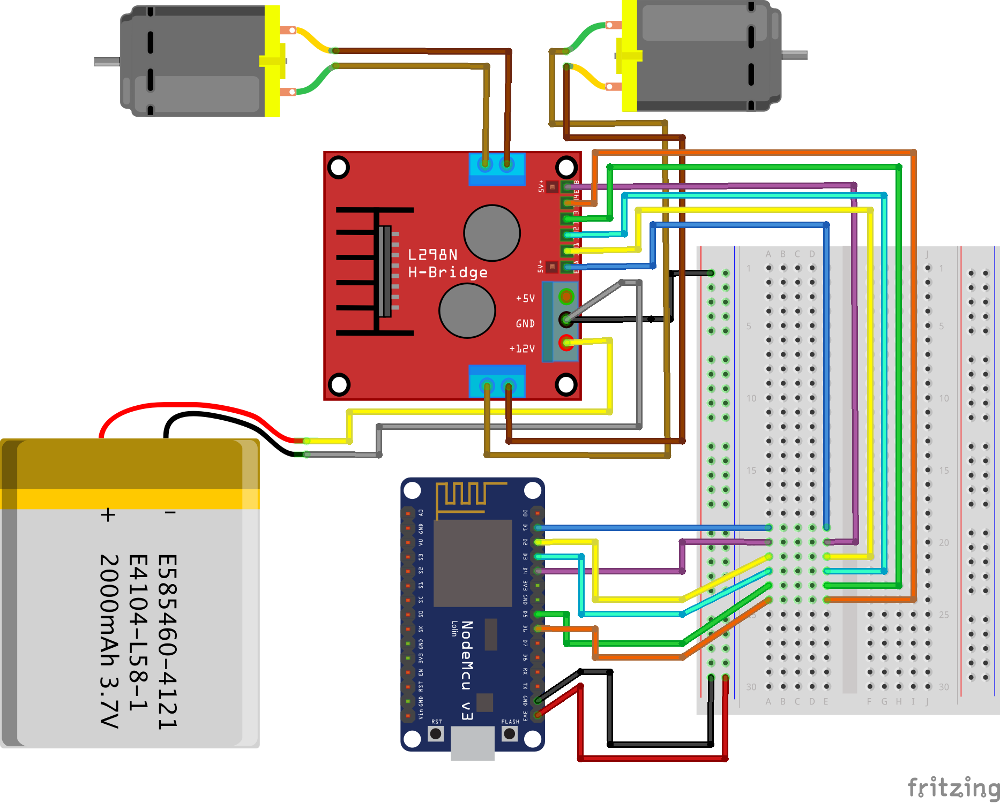
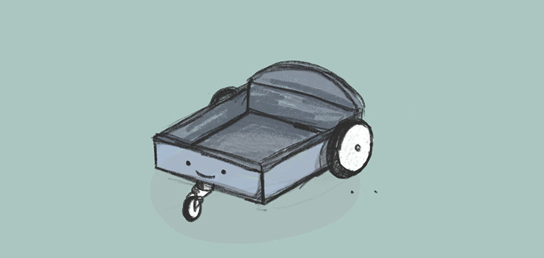

# FolloWe
A robot assistant that helps you everywhere!

“FolloWe” เป็นหุ่นยนต์ที่ช่วยในการย้ายสิ่งของ โดยที่ผู้ใช้ต้องทำการควบคุม ซึ่งหุ่นยนต์ FolloWe จะถูกควบคุมผ่านทางแอพ Blynk เพื่อนำทางอุปกรณ์อิเล็กทรอนิกส์ทั้งหมด ส่วนแผงวงจรต่างๆ จะถูกบรรจุไว้ในฐานของตัวหุ่นยนต์เพื่อให้สามารถนำวัตถุต่าง ๆ มาวางไว้ด้านบนของตัวหุ่นยนต์ได้ โดยหุ่นยนต์นี้จะช่วยเราย้ายสิ่งของที่ค่อนข้างมีน้ำหนักและขนาดไม่ใหญ่จนเกินไป ที่หุ่นยนต์สามารถรองรับได้

## Objective
* ช่วยในการทุ่นแรงสำหรับการเคลื่อนย้ายสิ่งของ
* ช่วยลดความเสี่ยงจากอาการหรือโรคต่างๆที่เกิดจากการยกของที่หนักเกินไป

## Equipments and Devices
<image src="image/13.jpg" width="33%" height="33%"><image src="image/5.jpg" width="33%" height="33%"><image src="image/3.jpg" width="33%" height="33%"><image src="image/4.jpg" width="33%" height="33%"><image src="image/2.jpg" width="33%" height="33%"><image src="image/1.jpg" width="33%" height="33%">
<image src="image/6.jpg" width="33%" height="33%">
<image src="image/7.jpg" width="33%" height="33%"><image src="image/8.jpg" width="33%" height="33%"><image src="image/9.jpg" width="33%" height="33%">
<image src="image/10.jpg" width="33%" height="33%"><image src="image/11.jpg" width="33%" height="33%">
  
<table>
  <tr><th>วัดถุดิบและอุปกรณ์อื่นๆ</th></tr>
  <tr><td>แผ่นไม้</td></tr>
  <tr><td>น็อต, สกรู, แหวนรอง</td></tr>
  <tr><td>แบตสำรอง (Powerbank)</td></tr>
  <tr><td>หัวแร้งสำหรับบัดกรี</td></tr>
  <tr><td>สว่าน</td></tr>
</table>

## Built With
* Arduino Uno (NodeMCU)
* Blynk
* C++

## How it works
NodeMCU ที่อยู่ในตัวหุ่นยนต์จะทำการเชื่อมต่อกับ Internet ด้วย WiFi ที่มีอยู่ในตัว แล้วติดต่อไปยังเซิฟเวอร์ของแอพ Blynk ที่เป็นตัวควบคุมตัวหุ่นยนต์
จากนั่นเมื่อมีการสั่งการเคลี่อนที่จะในแอพ Blynk ก็จะทำการส่งค่าสวิสซ์ไปสั่งให้วงจรทำงาน และหุ่นยนต์จะเคลื่อนที่ตามที่สั่ง

## Code
* [Arduino Project File](https://github.com/suphakit01/FolloWe/blob/master/NodeMCU_FolloWe.ino)

## System Diagram

## Presentation
* [Youtube](https://www.youtube.com/channel/UCZlMfjfZH7QHUnDT8k23p3Q)`We're very sorry, public tomorrow`
* [Poster](image/poster.jpg)

## Resources
* `Project Hub` - [https://create.arduino.cc/projecthub/](https://create.arduino.cc/projecthub/hackershack/make-an-autonomous-follow-me-cooler-7ca8bc)

## Contributor
* Suphakit  Nachom  61070250 - [suphakit01](https://github.com/suphakit01)
* Nathachai Shinasawasophon  61070049 - [exzenous](https://github.com/exzenous)
* Apinya Thammachai  61070258 - [Adopamine](https://github.com/Adopamine)
* Sunisa Chanbang 61070249 - [SunisaChanbang](https://github.com/SunisaChanbang)

## Special Thanks to
* Panwit Tuwanut
* Kitsuchart Pasupa
  

<image src="image/itlogo.png" width="250px" height="200px">
<image src="image/1000x1000kmitl.png" width="200px" height="200px">

